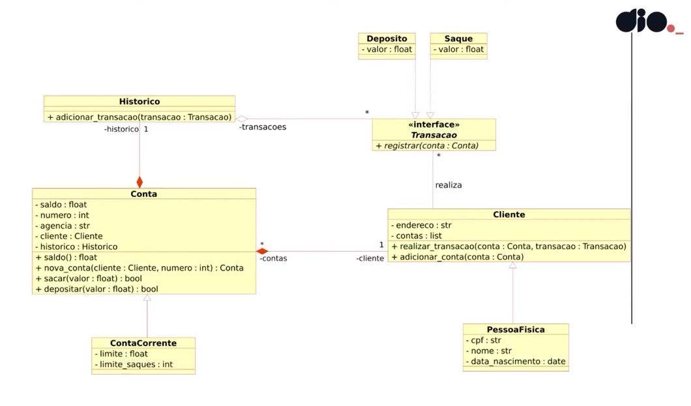

# Desafio de Projeto DIO - Otimizando o Sistema Bancário com Python

Este projeto trata-se da resolução do desafio do curso Santander 2025 - Back-End com Python com a DIO. Utilizando dos princípios de desenvolvimento com Python, praticando os conhecimentos adquiridos sobre estruturas de dados, listas e funções.  

Trata-se da "Versão 3" do sistema bancário proposto no Bootcamp.

Versão 1: [Aqui!](https://github.com/yukaum/desafio-dio-py-fundamentos/tree/main) Criar um sistema bancário com as operações: sacar, depositar e visualizar extrato.

Versão 2: [Aqui!](https://github.com/yukaum/desafio-dio-py-fundamentos/tree/main) Criar um sistema bancário com as operações: sacar, depositar e visualizar extrato.

Versão criada separadamente para submeter resolução no site da DIO. 

## Objetivo Geral

Implementação do sistema bancário para armazenar os dados de clientes e contas bancárias em objetos ao invés de dicionários. O código deve seguir o modelo de classes proposto.

## Requisitos das Operações

### Criar usuário:
O programa deve ser armazenar os usuários em uma lista e não deve permitir cadastrar 2 usuários ou mais com o mesmo CPF.
Informações do cliente devem conter: nome, data de nascimento, CPF, endereço.
O endereço é uma string com o formato: logradouro, nro - bairro - cidade/sigla estado.

### Criar conta corrente:
O programa deve armazenar contas em uma lista.  
Cada conta é composta por: agência, número de conta, usuário.  
O número de conta é sequencial, iniciando em 1.  
O número da agência é fixo: "0001".  
O usuário pode ter mais de uma conta, mas uma conta pertence apenas a um usuário.

### Depósito:
Deve ser possível depositar valores positivos.  
Todos os depósitos devem ser armazenados em uma variável e exibidos na operação de extrato.  

### Saque:
O sistema deve permitir realizar até 03 saques diários com limite máximo de R$ 500,00 por saque.  
Caso o usuário não tenha saldo em conta, o sistema deve exibir uma mensagem informando que não será possívelsacar o dinheiro por falta de saldo.  
Todos os saques devem ser armazenados em uma variável e exibidos n operação extrato.  

### Extrato:
Esta operação deve listar todas movimentações realizadas na conta.  
No fim da listagem deve er exibido o saldo atual. 
Se o extrato estiver em branco, exibir a mensagem: Não foram realizadas movimentações.  
Os valores devem ter o formato R$ xx.xx  

## REFERÊNCIAS
Código resolução repositório Github https://github.com/digitalinnovationone/trilha-python-dio/blob/main/01%20-%20Estrutura%20de%20dados/desafio.py
